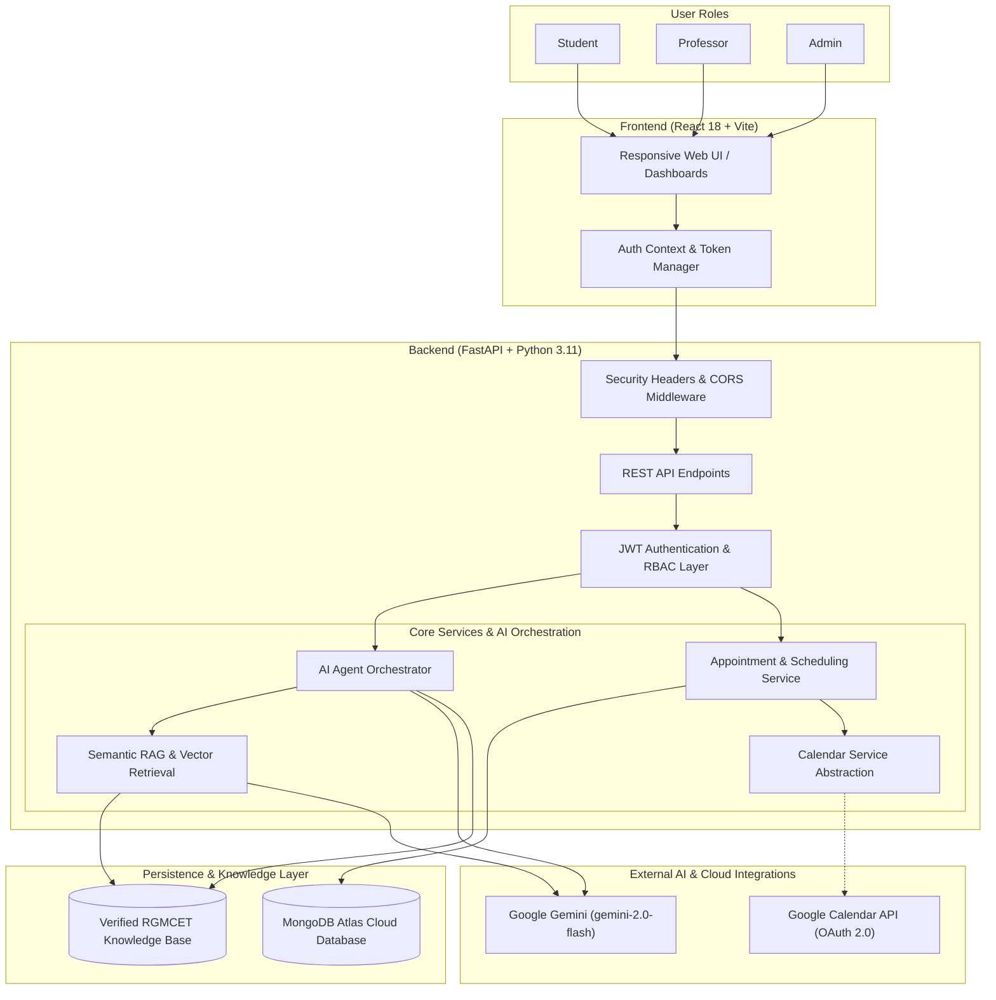
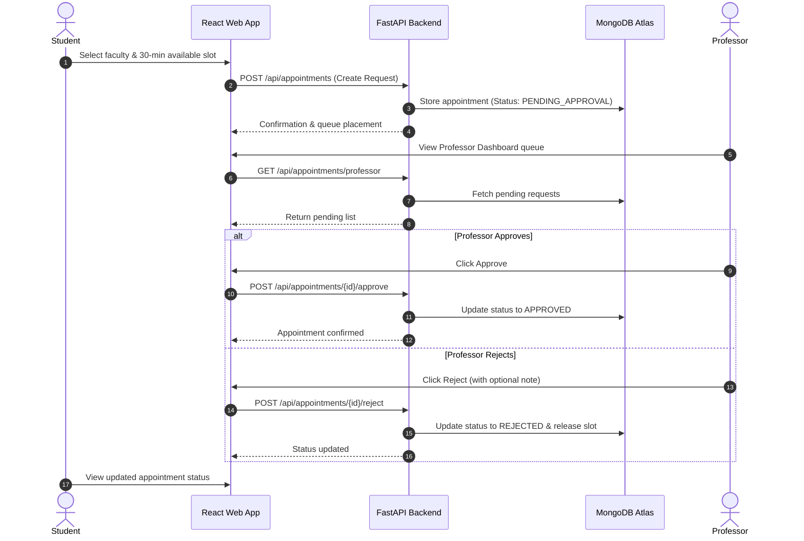

# RGMCET AI Campus Assistant

> An intelligent, production-ready campus inquiry and appointment management platform tailored for Rajeev Gandhi Memorial College of Engineering and Technology (RGMCET). Built with a FastAPI backend, React + Vite single-page frontend, semantic RAG knowledge grounding, and multi-role workflows for Students, Professors, and Administrators.

---

## 🌐 Live Demo & Deployment

The application is deployed live in production on **Render** with cloud persistence on **MongoDB Atlas**:

🔗 **Production URL**: [https://rgmcet-ai-campus-assistant.onrender.com](https://rgmcet-ai-campus-assistant.onrender.com/)

> [!NOTE]
> **Free Tier Cold Start Notice**: The production service is hosted on Render's free tier. If the instance has been inactive, the initial request may spin up the container and take approximately 30–60 seconds for a cold start. Subsequent requests execute instantly.

* **GitHub Branch**: `phase5`
* **Latest Deployment Dependency Commit**: `27b9be2`
* **Platform Architecture**: Single-origin web application (FastAPI serving compiled React/Vite SPA and REST API)

---

## 📋 Project Overview

### Problem Statement
College campuses host a high volume of recurring administrative inquiries regarding departmental structures, faculty contacts, academic programs, facilities, and visiting schedules. Students frequently face friction when seeking official, verified information or attempting to book time with professors whose availability varies across teaching timetables. Traditional bulletin boards and ungrounded messaging bots often present outdated details, lack accountability, or risk generating AI hallucinations.

### The Solution
The **RGMCET AI Campus Assistant** is a dedicated, website-only platform that unites:
1. **Grounded AI Campus Enquiry**: An intelligent chat assistant strictly anchored to official RGMCET institutional data, offering multilingual support (English, Telugu, and Roman Telugu) with verifiable source links and a deterministic fallback layer.
2. **Professor Directory & Availability Booking**: A structured appointment scheduling system enabling students to view verified 30-minute faculty availability slots and book consultations.
3. **Role-Based Portals**: Dedicated workspaces for Students, Professors (with admin verification workflows), and College Administrators with full governance, auditing, and RAG index control.

---

## ✨ Key Features

### 🤖 Grounded AI Campus Enquiry
* **Official Institutional Grounding**: Pre-indexed campus data covering departments, B.Tech/M.Tech programs, HODs, faculty rosters, campus timings, and college facilities.
* **Semantic RAG Pipeline**: Combines vector embeddings and lexical intent detection to retrieve relevant institutional records before response generation.
* **Hallucination Guardrails**: Prompts restrict the LLM to verified knowledge. If specific details (e.g., private cabin room numbers or unverified schedules) are not verified, the system safely declines rather than inventing facts.
* **Multilingual Interaction**: Native understanding and conversational fluency in **English**, **Telugu (తెలుగు)**, and **Roman Telugu** (e.g., *"CSE Data Science HOD evaru?"*).
* **Source Attribution**: Transparent responses with verifiable citations and source links to official RGMCET pages.
* **Resilient AI Fallback**: If external LLM API endpoints experience rate limits or network latency, the platform automatically switches to a deterministic pattern/keyword intent engine without breaking the user experience.

### 🎓 Student Features
* **Authentication & Dashboard**: Secure registration, JWT-authenticated login, and personal activity overview.
* **AI Chat Assistant**: Real-time conversational interface with persistent chat history.
* **Faculty Directory**: Browse faculty by department, view designations, qualifications, and profile details.
* **Appointment Scheduling**: Browse published weekly availability and request 30-minute consultation slots.
* **Appointment Tracking**: Live lifecycle monitoring (`PENDING_APPROVAL`, `APPROVED`, `REJECTED`, `CANCELLED`), cancellation, and slot release for rebooking.

### 👨‍🏫 Professor Features
* **Regulated Onboarding**: Professor registration enters a `PENDING_APPROVAL` queue; accounts cannot log in until verified and activated by an Administrator.
* **Dedicated Professor Dashboard**: High-level metrics showing pending appointment requests, approved meetings, and schedules.
* **Queue Management**: Review pending student consultation requests with one-click **Approve**, **Reject** (with optional feedback), or **Cancel** actions.
* **Schedule & Availability**: Manage weekly availability slots and synchronize student booking states.
* **Calendar Abstraction**: Built-in service abstraction supporting external calendar synchronization (Google Calendar OAuth 2.0 integration with verified fallback).

### 🛡️ Administrator Features
* **Overview & System Metrics**: High-level dashboard tracking user signups, total appointments, active faculty, and system status.
* **Knowledge Management**: Full CRUD operations on campus records (Campus, Department, Facility, Faculty) with verification flags and archiving.
* **RAG Diagnostics & Index Management**: Real-time vector store statistics, on-demand reindexing, and semantic query preview for administrators.
* **Faculty, Department & Facility Views**: Centralized catalog management for all institutional structures.
* **User Management & Approval Workflow**: Approve or reject newly registered professor accounts, modify roles, and toggle user active states.
* **Appointment Governance**: Complete oversight across all student-faculty bookings, status filtering, and administrative overrides.
* **AI Analytics**: Categorized breakdowns of user queries, intent distributions, multilingual traffic shares, and confidence scores.
* **Agent Diagnostics**: Registry inspection of active agent tools and multi-step reasoning traces.
* **Audit Logs**: Immutable audit log recording all administrative overrides, user state changes, and knowledge updates.
* **System Health Monitor**: Live checks verifying backend API, MongoDB Atlas database connectivity, and LLM provider availability.

---

## 🏛️ System Architecture

The following diagram illustrates the end-to-end architecture of the RGMCET AI Campus Assistant:



---

## 🧠 AI & RAG Architecture

```
User Message (English / Telugu / Roman Telugu)
   │
   ▼
1. Pre-Processing & Language / Intent Classification
   │
   ▼
2. Semantic Retrieval (RAG)
   ├── Query Vectorization (Embeddings)
   ├── Cosine Similarity Match against Verified RGMCET Knowledge
   └── Context Assembly with Source Attribution Links
   │
   ▼
3. Reasoning & Tool Calling (ReAct Loop)
   ├── `search_knowledge`      -> Institutional data lookup
   ├── `search_professor`      -> Faculty directory lookup
   ├── `check_availability`    -> Timetable slot verification
   └── `create_appointment`    -> Guarded booking action
   │
   ▼
4. Grounded Generation (Gemini 2.0 Flash)
   └── Strict System Prompt (Forbidden to hallucinate unverified details)
   │
   ▼ (In case of external API failure)
   └── Deterministic Fallback Pipeline (Rule/Regex Engine)
   │
   ▼
Final Structured Response with Verified Sources
```

* **Intent Understanding**: Classifies queries across categories (e.g., `CAMPUS_INFORMATION`, `DEPARTMENT_INFORMATION`, `FACULTY_INFORMATION`, `FACILITY_INFORMATION`, `PROFESSOR_APPOINTMENT`).
* **Context Preservation**: Multi-turn conversation sessions retain contextual history for coherent follow-up questions.
* **Semantic Embeddings**: Knowledge records are transformed into vector representations for high-accuracy semantic retrieval, handling variations in student phrasing.
* **Verified Knowledge Base**: Extracted from official college documentation, including accredited B.Tech branches (CSE, CSE-DS, ECE, EEE, Mechanical, Civil), campus amenities (Central Library, Health Center, Canteen, Auditorium), and administrative leadership.
* **Grounded Fallback**: If an inquiry asks for non-public or unindexed data (e.g., personal phone numbers or unverified room numbers), the model gracefully acknowledges the limitation rather than fabricating an answer.

---

## 🔄 User & Appointment Workflows

### 1. Student Workflow
1. Register with username, email, password, and optional department/year details.
2. Sign in to access the **Student Dashboard**.
3. Launch the **AI Campus Enquiry Chatbot** to ask questions in English, Telugu, or Roman Telugu.
4. Navigate to the **Professors** tab to find faculty and inspect open 30-minute consultation slots.
5. Submit an appointment request with an academic agenda.
6. Track appointment state in the **Appointments** tab (`PENDING_APPROVAL` → `APPROVED` / `REJECTED`).
7. Cancel or reschedule appointments as necessary.

### 2. Professor Workflow
1. Register with department details and academic designation.
2. Account is marked `PENDING_APPROVAL` (login is prohibited until an Administrator approves the account).
3. Once approved, log in to the **Professor Dashboard**.
4. Review incoming student consultation requests in the **Pending Requests** queue.
5. Accept requests (changing status to `APPROVED`) or reject requests (with optional explanatory remarks).
6. View weekly appointment timetable and update available consultation slots.

### 3. Admin Workflow
1. Log in with administrative credentials to access the 12-tab **Admin Dashboard**.
2. **User Management**: Approve pending professor accounts, adjust roles, or deactivate users.
3. **Knowledge Base**: Insert new campus records, verify accuracy, or archive outdated entries.
4. **RAG Monitoring**: Check vector indexing health, initiate full reindexing, and run semantic query previews.
5. **Appointments Oversight**: Inspect all college appointment records, filter by status, and execute overrides when necessary.
6. **Audit Logs & Analytics**: Inspect immutable audit logs of all actions and review AI query distribution analytics.
7. **System Health**: Monitor live health statuses for API, MongoDB Atlas, and Gemini.

### 4. Appointment Lifecycle Diagram



---

## 🔒 Authentication & Security

* **JWT-Based Authentication**: Stateless token generation using `python-jose` with configurable expiry (`JWT_EXPIRE_MINUTES`).
* **Role-Based Access Control (RBAC)**: Strict role demarcation (`student`, `professor`, `admin`) enforced by server-side FastAPI dependencies (`get_current_active_user`, `require_role`).
* **Resource Ownership Protection**: Students can only view, manage, or cancel their own appointments; professors can only respond to appointments booked with them; administrators hold monitored override authority.
* **Password Hashing**: Secure password hashing with Salt using `passlib[bcrypt]`.
* **Hardened HTTP Security Headers**:
  * `X-Content-Type-Options: nosniff`
  * `X-Frame-Options: DENY`
  * `Referrer-Policy: strict-origin-when-cross-origin`
* **CORS Isolation**: Controlled origins via `CORS_ORIGINS` configuration.
* **Sanitized Global Error Handling**: Unhandled exceptions return generic, non-leaking HTTP 500 error messages to prevent internal stack trace exposure.
* **Strict Secret Isolation**: No API keys, database credentials, or JWT secrets are bundled into client-side code; all secrets are managed exclusively on the server.

---

## 🛠️ Technology Stack

| Layer | Technology | Details |
| :--- | :--- | :--- |
| **Frontend Framework** | React 18 | Declarative single-page application |
| **Build Tool** | Vite 6 | Fast modern module bundler |
| **Styling & Icons** | Vanilla CSS + Tailwind CSS + Lucide React | Clean, responsive institutional theme |
| **Backend Framework** | FastAPI (Python 3.11) | High-performance asynchronous REST API |
| **ASGI Server** | Uvicorn | Production-ready ASGI web server |
| **Database** | MongoDB Atlas | Cloud-hosted NoSQL database with Motor async driver |
| **LLM Provider** | Google Gemini (`gemini-2.0-flash`) | Primary conversational AI model via Gemini API |
| **RAG & Search** | Vector Embeddings + Cosine Match | Semantic retrieval over official RGMCET documents |
| **Authentication** | JWT (`python-jose`) + Bcrypt (`passlib`) | Stateless tokens with role-based access control |
| **Calendar Service** | Google Calendar API / Service Abstraction | OAuth 2.0 integration with documented fallback |
| **Containerization** | Multi-stage Docker | Node 20 builder + Python 3.11-slim runtime |
| **Cloud Hosting** | Render | Automated web service container deployment |

---

## 📁 Project Structure

```
├── Dockerfile                         # Multi-stage Docker build (React builder + Python runtime)
├── render.yaml                        # Render blueprint configuration
├── docker-compose.yml                 # Local container orchestration specification
├── requirements.txt                   # Production Python dependencies
├── pytest.ini                         # Pytest test suite configuration
├── .env.example                       # Reference environment variable template
├── app/
│   ├── web_intents.py                 # Deterministic fallback intent matching rules
│   └── web_mvp/
│       ├── main.py                    # FastAPI entrypoint, middlewares, and SPA mounting
│       ├── config.py                  # Environment variable configuration loading
│       ├── auth.py                    # JWT authentication and password hashing logic
│       ├── auth_schemas.py            # Pydantic schemas for authentication
│       ├── schemas.py                 # Core schemas (appointments, chats, knowledge)
│       ├── store.py                   # MongoDB Atlas connection manager & async collections
│       ├── services.py                # Business logic for appointments and schedules
│       ├── knowledge.py               # Official RGMCET knowledge retrieval and grounding
│       ├── vector_store.py            # Semantic vector store interface
│       ├── embeddings.py              # Text embedding generation
│       ├── llm.py                     # LLM client abstraction (Gemini / OpenAI)
│       ├── agent.py                   # Multi-turn AI Agent orchestrator
│       ├── tools.py                   # Agent tool registry (search, appointments, availability)
│       ├── calendar_service.py        # Calendar integration and fallback abstraction
│       └── api/
│           ├── auth.py                # Endpoints: /api/auth (register, login, me)
│           ├── chat.py                # Endpoints: /api/chat (conversational inquiry)
│           ├── professors.py          # Endpoints: /api/professors (directory & schedule)
│           ├── appointments.py        # Endpoints: /api/appointments (booking & lifecycle)
│           └── admin.py               # Endpoints: /api/admin (users, knowledge, audit, RAG)
├── data/
│   ├── demo_professors.json           # Baseline verified faculty profiles
│   ├── demo_professor_schedules.json  # Standard weekly 30-minute consultation slots
│   └── rgmcet_knowledge/
│       ├── college_info.json          # Accreditation, vision, mission, leadership
│       ├── departments.json           # Academic programs, HODs, intake details
│       ├── facilities.json            # Campus facilities, library, sports, amenities
│       ├── timings.json               # College working hours and academic schedules
│       ├── vector_store.json          # Pre-computed semantic vector embeddings
│       └── faculty/                   # Departmental faculty records
├── frontend/
│   ├── package.json                   # Frontend scripts and npm dependencies
│   ├── vite.config.js                 # Vite bundler configuration
│   ├── tailwind.config.js             # Tailwind CSS design system tokens
│   ├── index.html                     # HTML5 single-page application entrypoint
│   └── src/
│       ├── main.jsx                   # React application mount
│       ├── App.jsx                    # Root routing and page shell
│       ├── styles.css                 # Global styling and custom design rules
│       ├── ErrorBoundary.jsx          # UI exception isolation boundary
│       ├── components/
│       │   ├── ChatWindow.jsx         # Conversational chat interface with sources
│       │   ├── ProfessorCard.jsx      # Faculty card with department and action buttons
│       │   └── Sidebar.jsx            # Multi-role navigation sidebar
│       ├── contexts/
│       │   └── AuthContext.jsx        # User state, JWT storage, login/logout handlers
│       ├── pages/
│       │   ├── Login.jsx              # User sign-in page
│       │   ├── Register.jsx           # User registration page
│       │   ├── StudentDashboard.jsx   # Student overview and quick actions
│       │   ├── Chat.jsx               # Dedicated AI campus assistant chat page
│       │   ├── Professors.jsx         # Faculty directory & appointment booking
│       │   ├── Appointments.jsx       # Student appointments tracking view
│       │   ├── ProfessorDashboard.jsx # Professor request approval dashboard
│       │   └── AdminDashboard.jsx     # Comprehensive 12-tab administrator portal
│       └── services/
│           └── api.js                 # Centralized Axios/fetch API client
├── scripts/
│   ├── seed_database.py               # Database initialization script
│   ├── test_mongodb_atlas.py          # MongoDB Atlas connectivity validation
│   └── verify_phase12_production.py   # Automated production browser verification suite
└── tests/
    ├── conftest.py                    # Shared pytest test fixtures
    ├── test_phase3_auth.py            # Authentication, registration & RBAC test cases
    ├── test_phase4.py                 # Multi-role dashboard test cases
    ├── test_phase10_admin.py          # Administrator dashboard and governance test cases
    ├── test_admin_appointment_workflow.py # End-to-end appointment lifecycle test cases
    ├── test_agent_queries.py          # Multilingual and grounding query test cases
    ├── test_llm_provider.py           # LLM provider abstraction and fallback test cases
    ├── test_knowledge.py              # Knowledge retrieval and grounding tests
    ├── test_web_api.py                # REST API route integration tests
    └── test_web_intents.py            # Deterministic fallback intent tests
```

---

## 🔑 Environment Variables

The application relies on the following environment variable names. For security, never commit real values or `.env` files into source control.

| Variable Name | Required | Description | Example Placeholder |
| :--- | :--- | :--- | :--- |
| `APP_ENV` | Yes | Application environment | `production` or `development` |
| `PORT` | No | Server listen port (default: 8000) | `8000` |
| `MONGODB_URI` | Yes | MongoDB Atlas connection string | `mongodb+srv://<user>:<password>@<cluster>.mongodb.net/?retryWrites=true&w=majority` |
| `DATABASE_NAME` | Yes | Database name in MongoDB | `rgmcet_ai_assistant` |
| `JWT_SECRET` | Yes | Secret key for signing JWT tokens | `<your-secure-random-secret>` |
| `JWT_EXPIRE_MINUTES` | No | Expiration time for access tokens | `60` |
| `LLM_PROVIDER` | Yes | AI model provider (`gemini` or `openai`) | `gemini` |
| `GEMINI_API_KEY` | Yes | Google Gemini API key | `<your-gemini-api-key>` |
| `GEMINI_MODEL` | No | Gemini model name | `gemini-2.0-flash` |
| `CORS_ORIGINS` | No | Allowed CORS origins (comma-separated) | `http://localhost:5173,https://rgmcet-ai-campus-assistant.onrender.com` |
| `GOOGLE_CALENDAR_ENABLED` | No | Toggle Google Calendar integration | `false` |
| `GOOGLE_CLIENT_ID` | No | Google OAuth 2.0 Client ID | `<your-google-client-id>` |
| `GOOGLE_CLIENT_SECRET` | No | Google OAuth 2.0 Client Secret | `<your-google-client-secret>` |
| `GOOGLE_REFRESH_TOKEN` | No | Google OAuth 2.0 Refresh Token | `<your-google-refresh-token>` |
| `GOOGLE_CALENDAR_ID` | No | Target Calendar ID | `primary` |

---

## 💻 Local Development Setup

### Prerequisites
* **Python**: 3.11+
* **Node.js**: 20+
* **MongoDB**: Local MongoDB instance or free MongoDB Atlas cluster

### 1. Clone the Repository
```bash
git clone https://github.com/challa-obulesh/RGMCET-AI-ASISTANCE-.git
cd RGMCET-AI-ASISTANCE-
git checkout phase5
```

### 2. Configure Environment
```bash
cp .env.example .env
# Edit .env with your local credentials and API keys
```

### 3. Backend Setup
```powershell
# Create and activate virtual environment
python -m venv .venv
.\.venv\Scripts\Activate.ps1    # On Linux/macOS: source .venv/bin/activate

# Install dependencies
pip install -r requirements.txt

# Start backend development server
uvicorn app.web_mvp.main:app --host 127.0.0.1 --port 8000 --reload
```
The backend API documentation is accessible at `http://127.0.0.1:8000/docs`.

### 4. Frontend Setup
In a separate terminal:
```bash
cd frontend
npm install
npm run dev
```
The frontend development server starts at `http://localhost:5173`.

---

## 🚀 Production Deployment

### Containerized Deployment on Render
The application is packaged with a multi-stage Dockerfile that builds the React application into optimized static assets and serves them directly through FastAPI in a unified container.

1. **Create Web Service**: Connect your GitHub repository to [Render](https://render.com).
2. **Environment**: Select `Docker`.
3. **Branch**: `phase5`.
4. **Environment Variables**: Populate the production variables (`MONGODB_URI`, `DATABASE_NAME`, `JWT_SECRET`, `LLM_PROVIDER`, `GEMINI_API_KEY`, etc.) in the Render Dashboard.
5. **Health Check Path**: `/api/health`.

### MongoDB Atlas Cloud Database
1. Provision a free `M0` cluster on [MongoDB Atlas](https://www.mongodb.com/atlas).
2. Create a database user with read/write privileges.
3. Configure Network Access to allow traffic from anywhere (`0.0.0.0/0`) or Render outbound IP ranges.
4. Copy the connection URI into the `MONGODB_URI` environment variable on Render.

---

## 🧪 Testing & Verification Status

The project includes an extensive automated test suite covering all layers of the application.

```powershell
# Run the complete backend test suite
.\.venv\Scripts\python.exe -m pytest tests/ -v
```

### Verified Testing Results:
* **Backend Test Suite**: **222 / 222 tests passing** (100% pass rate).
* **Frontend Production Build**: **Pass** (Clean Vite compilation into `frontend/dist` with zero errors).
* **Production Deployment**: Verified live and operational on Render.
* **MongoDB Atlas Persistence**: Read/write operations verified against cloud database.
* **Secret Hygiene Audit**: Completed with zero exposed credentials or keys across tracked Git files.
* **Browser Production Gates**: 55/55 production gates validated in Google Chrome across desktop and mobile viewports.

---

## 🛡️ Security Best Practices

* **No Secrets in Source Control**: Secrets, API keys, and connection strings must never be committed. The `.env` file is strictly ignored via `.gitignore`.
* **Zero Client-Side Exposure**: Client-side JavaScript bundles never receive LLM API keys or database connection strings. All external API calls originate server-side.
* **Server-Side Enforcement**: Role authorization is validated on every API request. UI button masking is paired with strict server-side HTTP 403 Forbidden enforcement.
* **Production Key Management**: All production secrets are managed exclusively through cloud provider environment variables (Render Environment settings).

---

## 🔮 Future Improvements

The following items are planned for future iterations and are clearly demarcated as upcoming work:
* **Multi-Channel Integrations**: Webhook-based integration with messaging channels such as WhatsApp and Telegram.
* **Automated Notifications**: Email and SMS alerts for upcoming appointments, schedule changes, and approval notifications.
* **Institutional SSO Integration**: Single Sign-On via Google Workspace / SAML for campus credentials.
* **Multi-Campus Multi-Tenant Scaling**: Support for multiple colleges or affiliated institutions on a unified infrastructure.

---

## 👨‍💻 Project Information

* **Institution**: Rajeev Gandhi Memorial College of Engineering and Technology (RGMCET)
* **Project**: AI Campus Assistant
* **Repository**: [https://github.com/challa-obulesh/RGMCET-AI-ASISTANCE-](https://github.com/challa-obulesh/RGMCET-AI-ASISTANCE-)
* **Primary Branch**: `phase5`